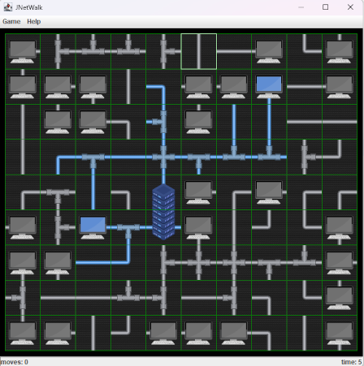

###### README

Alexey Zaryaev

###### INTRODUCTION

JNetWalk is a puzzle Java/Swing game based on C code at https://github.com/blynn/netwalk,  in which the player must connect every terminal to the main server. 

###### USAGE

Click on a square to rotate its contents. A left click performs an
anticlockwise rotation and a right click performs a clockwise rotation.

###### LICENSE

This project is released under the GNU Public License. 
